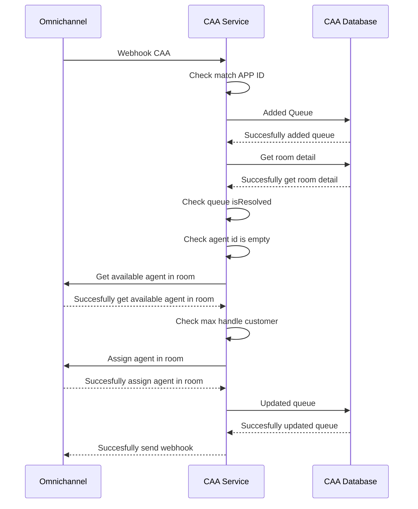
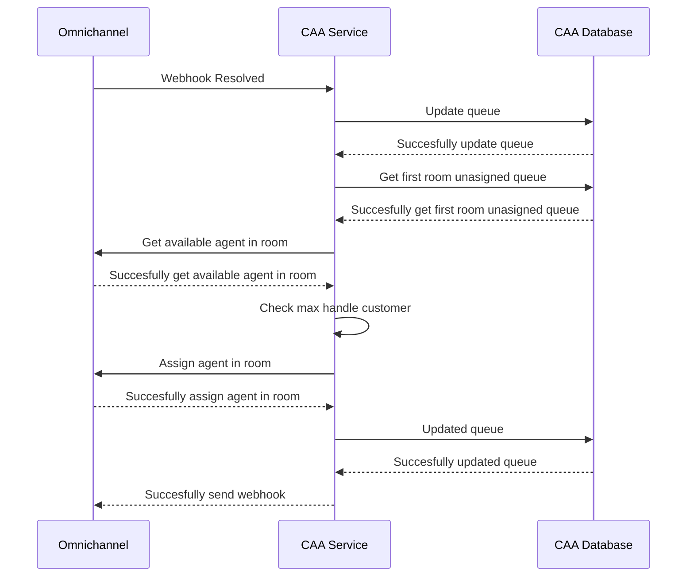
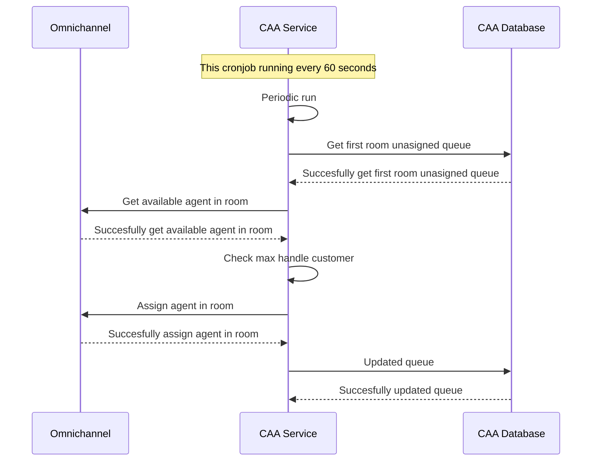
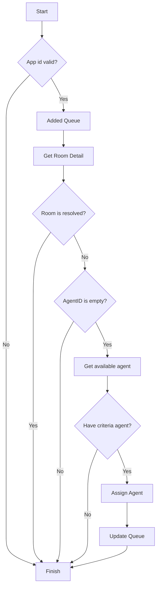
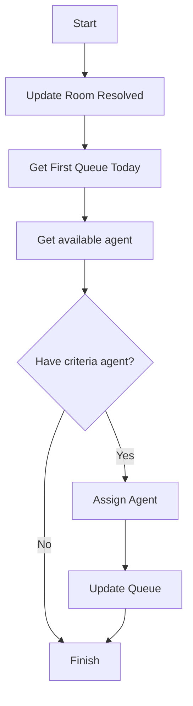

# Room

## Sequence Diagram
### Assigned Agent with Webhook CAA
Here is a sequence process for assigned flow agent when get webhook from CAA:

### Assigned Agent with Webhook Mark As Resolved
Here is a sequence process for assigned flow agent when get webhook resolved:


### Assigned Agent with Cronjob
Here is a sequence process for assigned flow with cronjob in delay 60 seconds:


## FlowChart
### Assigned Agent with Webhook CAA
Here is a flowchart for assigned flow agent when get webhook from CAA:


### Assigned Agent Webhook Mark As Resolved
Here is a flowchart for assigned flow agent when get webhook resolved:



## ERD
Here is a ERD for Queue
```mermaid
erDiagram
    agent_allocation_queues {
        uint id PK
        string room_id
        string agent_id
        bool is_resolved
        datetime created_at
        datetime update_at
    }


