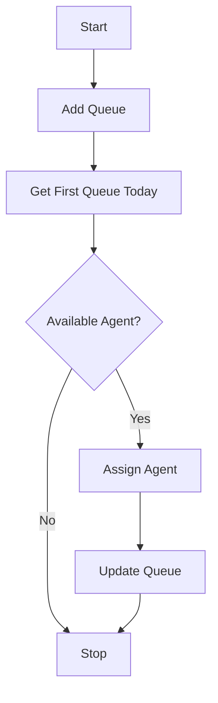
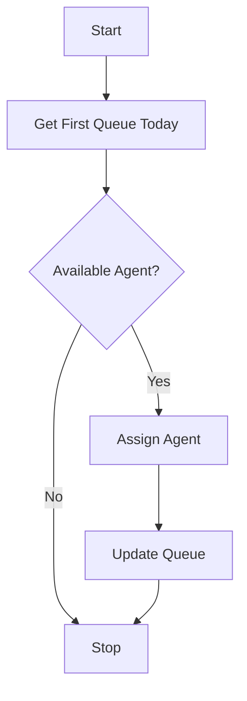

# Room 

## FlowChart
### Webhook CAA
Here is a flowchart for Webhhok CAA:


### Webhook Mark As Resolved
Here is a flowchart for Webhook Mark As Resolved:



## ERD
Here is a ERD for Queue
```mermaid
erDiagram
    agent_allocation_queues {
        uint ID PK
        string RoomID
        string AgentID
        datetime CreatedAt
    }


